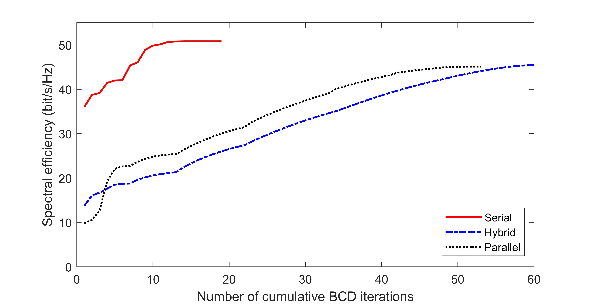

# TTD Configurations for Near-Field Beamforming: Parallel, Serial, or Hybrid?

The code for the papers 

**Z. Wang, X. Mu, Y. Liu, and R. Schober, “TTD Configurations for Near-Field Beamforming: Parallel, Serial, or Hybrid?,” *IEEE Trans. Commun.*, Early Access, Mar, 2024.** [[IEEE](https://ieeexplore.ieee.org/abstract/document/10458958)] [[Arxiv](https://arxiv.org/abs/2309.06861)]


## Running the simulations

### Prerequisites

- [MATLAB](https://uk.mathworks.com/products/matlab.html)

### Launch

Run `main.m`

### Expected Results

#### Convergence of the Proposed Algorithms


## Citing
If you in any way use this code for research, please cite our original articles listed above. The corresponding BiBTeX citation is given below:
```
@article{wang2024ttd,
  title={{TTD} configurations for near-field beamforming: Parallel, serial, or hybrid?},
  author={Wang, Zhaolin and Mu, Xidong and Liu, Yuanwei and Schober, Robert},
  journal={{IEEE} Trans. Commun.},
  year={accepted to appear, 2024}
}
```
